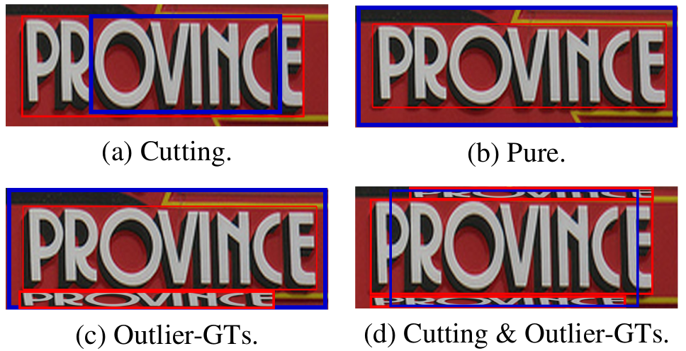
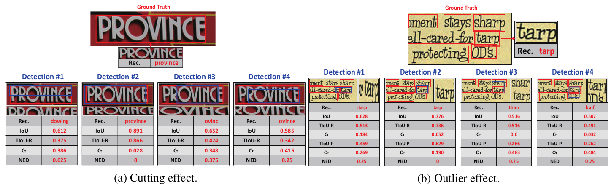
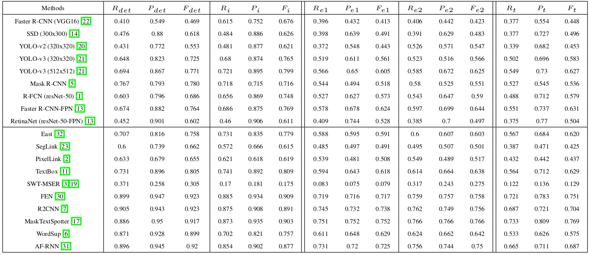
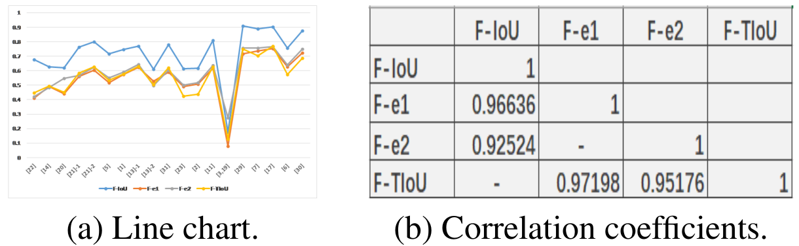
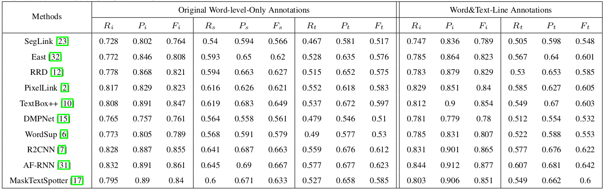

# TIoU-metric
Release on 27/03/2019. This repository is built on the ICDAR 2015 evaluation code.

* If you propose a better metric and require further evaluation, we can provide all the detection results used on this paper.  For this purpose, you can send email to liu.yuliang@mail.scut.edu.cn and copy to lianwen.jin@gmail.com.

* [[Python 3 version]](https://github.com/PkuDavidGuan/TIoU-metric-python3) by PkuDavidGuan.

## State-of-the-art Results on Total-Text and CTW1500 (TIoU)
We sincerely appreciate the authors of recent and previous state-of-the-art methods for providing their results for evaluating TIoU metric in curved text benchmarks. The results are listed below:

### Total-Text

| Methods on Total-Text     |  TIoU-Recall (%)  |  TIoU-Precision (%)  |   TIoU-Hmean (%)     |    Publication   | 
|:--------:  | :-----:   | :----:      |  :-----:     | :-----: |
|LSN+CC [[paper]](https://arxiv.org/abs/1903.09837)| 48.4     |  59.8       |    53.5      |   arXiv 1903 |
|Polygon-FRCNN-3 [[paper]](https://link.springer.com/article/10.1007/s10032-019-00334-z)|  47.9    |  61.9    |    54.0      |  IJDAR 2019 |
|CTD+TLOC [[paper]](https://arxiv.org/abs/1712.02170)[[code]](https://github.com/Yuliang-Liu/Curve-Text-Detector) | 50.8     |  62.0       |    55.8      |   arXiv 1712 | 
|ATRR [[paper]](https://arxiv.org/pdf/1905.05980.pdf)| 53.7     |  63.5       |    58.2      |   CVPR 2019 |
|PSENet [[paper]](https://arxiv.org/abs/1903.12473)[[code]](https://github.com/whai362/PSENet)  | 53.3 |  66.9      |    59.3     |  CVPR 2019 |
|CRAFT [[paper]](https://arxiv.org/abs/1904.01941) | 54.1 | 65.5 | 59.3 | CVPR 2019 |
|TextField [[paper]](https://ieeexplore.ieee.org/stamp/stamp.jsp?tp=&arnumber=8648420)|  58.0    |  63.0    |    60.4      |   TIP 2019 |
|Mask TextSpotter [[paper]](https://arxiv.org/abs/1807.02242)|  54.5    |  68.0    |    60.5      |   ECCV 2018 |
|SPCNet [[paper]](https://arxiv.org/abs/1811.08605)[[code]](https://github.com/AirBernard/Scene-Text-Detection-with-SPCNET) | 61.8     |  69.4       |    65.4      |   AAAI 2019 | 

### CTW1500

| Methods on CTW1500     |  TIoU-Recall (%)  |  TIoU-Precision (%)  |   TIoU-Hmean (%)     |    Publication   | 
|:--------:  | :-----:   | :----:      |  :-----:     | :-----: |
|CTD+TLOC [[paper]](https://arxiv.org/abs/1712.02170)[[code]](https://github.com/Yuliang-Liu/Curve-Text-Detector) | 42.5     |  53.9       |    47.5      |   arXiv 1712 | 
|ATRR [[paper]](https://arxiv.org/pdf/1905.05980.pdf)| 54.9     |  61.6       |    58.0      |   CVPR 2019 |
|LSN+CC [[paper]](https://arxiv.org/abs/1903.09837)| 55.9     |  64.8       |    60.0      |   arXiv 1903 |
|PSENet [[paper]](https://arxiv.org/abs/1903.12473)[[code]](https://github.com/whai362/PSENet)  | 54.9 |  67.6      |    60.6     |  CVPR 2019 |
|CRAFT [[paper]](https://arxiv.org/abs/1904.01941) | 56.4 | 66.3 | 61.0 | CVPR 2019 |
|MSR [[paper]](https://arxiv.org/abs/1901.02596)|  56.3    |  67.3     |    61.3    |   arXiv 1901 |
|TextField [[paper]](https://ieeexplore.ieee.org/stamp/stamp.jsp?tp=&arnumber=8648420)|  57.2    |  66.2    |    61.4      |   TIP 2019 | 
|TextMountain [[paper]](https://arxiv.org/pdf/1811.12786.pdf)  | 60.7   |  68.1       |    64.2     |  arXiv 1811 |
|PAN Mask R-CNN [[paper]](https://arxiv.org/pdf/1811.09058.pdf)| 61.0    |  70.0       |    65.2     |  WACV 2019 |

# Description
Evaluation protocols plays key role in the developmental progress of text detection methods. There are strict requirements to ensure that the evaluation methods are fair, objective and reasonable. However, existing metrics exhibit some obvious drawbacks: 

<div align=center></div>
*Unreasonable cases obtained using recent evaluation metrics. (a), (b), (c), and (d) all have the same IoU of 0.66 against the GT. Red: GT. Blue: detection.

* As shown in (a), previous metrics consider that the GT has been entirely recalled.

* As shown in (b), (c), and (d), even if containing background noise, previous metrics consider such detection to have 100% precision.

* Previous metrics consider detections (a), (b), (c), and (d) to be equivalent perfect detections. 

* Previous metrics severely rely on an IoU threshold. High IoU threshold may discard some satisfactory bounding boxes, while low IoU threshold may include several inexact bounding boxes.

To address many existing issues of previous evaluation metrics, we propose an improved evaluation protocol called **Tightnessaware Intersect-over-Union (TIoU) metric** that could quantify:

* **Completeness of ground truth**

* **Compactness of detection**

* **Tightness of matching degree**

We hope this work can raise the attentions of the text detection evaluation metrics and serve as a modest spur to more valuable contributions. More details can be found on our [paper](https://arxiv.org/abs/1904.00813). 

# Clone the TIoU repository
Clone the TIoU-metric repository
  ```Shell
  git clone https://github.com/Yuliang-Liu/TIoU-metric.git --recursive
  ```

# Getting Started
Install required module
  ```Shell
  pip install Polygon2
  ```
Then run
  ```Shell
  python script.py -g=gt.zip -s=pixellinkch4.zip
  ```
After that you can see the evaluation resutls.

 You can simply replace pixellinkch4.zip with your own dection results, and make sure your dection format follows the same as [ICDAR 2015](http://rrc.cvc.uab.es/?ch=4&com=tasks).

# Joint Word&Text-Line Evaluation
  To test your detection with our joint Word&Text-Line solution, simply
  ```Shell
  cd Word_Text-Line
  ```
  Then run the code
  ```Shell
  python script.py -g=gt.zip -gl=gt_textline.zip -s=pixellinkch4.zip
  ```
# Support Curved Text Evaluation
  Curved text requires polygonal input with mutable number of points. To evaluate your results on recent curved text benchmarks [Total-text](https://github.com/cs-chan/Total-Text-Dataset) or [SCUT-CTW1500](https://github.com/Yuliang-Liu/Curve-Text-Detector), you can refer to curved-tiou/readme.md.
   
# Example Results
### Qualitative results:
<div align=center></div>
*Qualitative visualization of TIoU metric. Blue: Detection. Bold red: Target GT region. Light red: Other GT regions. Rec.: Recognition results by CRNN [24]. NED: Normalized edit distance. Previous metrics evaluate all detection results and target GTs as 100% precision and recall, respectively, while in TIoU metric, all matching pairs are penalized by different degrees. Ct is defined in Eq. 10. Ot is defined in Eq. 13. Please refer to our paper for all the references. <br/>
  
### ICDAR 2013 results:
<div align=center></div>
*Comparison of evaluation methods on ICDAR 2013 for general detection frameworks and previous state-of-the-art methods. det: DetEval. i: IoU. e1: End-to-end recognition results by using CRNN [24]. e2: End-to-end recognition results by using RARE [25]. t: TIoU. <br/>
  
### Line chart:
<div align=center></div>
*(a) X-axis represents the detection methods listed in the Table above, and Y-axis represents the values of the F-measures.  <br/>
  
### ICDAR 2015 results:
<div align=center></div>
*Comparison of metrics on the ICDAR 2015 challenge 4. Word&Text-Line Annotations use our new solution to address OM and MO issues. i: IoU. s: SIoU. t: TIoU. <br/>

## Citation
If you find our metric useful for your reserach, please cite
```
@article{liu2019tightness,
  title={Tightness-aware Evaluation Protocol for Scene Text Detection},
  author={Liu, Yuliang and Jin, Lianwen and Xie, Zecheng and Luo, Canjie and Zhang, Shuaitao and Xie, Lele},
  journal={CVPR},
  year={2019}
}
```

## References
If you are insterested in developing better scene text detection metrics, some references recommended here might be useful.

[[1]](https://link.springer.com/article/10.1007/s10032-006-0014-0) Wolf, Christian, and Jean-Michel Jolion. "Object count/area graphs for the evaluation of object detection and segmentation algorithms." International Journal of Document Analysis and Recognition (IJDAR) 8.4 (2006): 280-296.

[[2]](https://www.sciencedirect.com/science/article/pii/S0262885615001377) Calarasanu, Stefania, Jonathan Fabrizio, and Severine Dubuisson. "What is a good evaluation protocol for text localization systems? Concerns, arguments, comparisons and solutions." Image and Vision Computing 46 (2016): 1-17.

[[3]](https://ieeexplore.ieee.org/abstract/document/8395220) Dangla, Aliona, et al. "A first step toward a fair comparison of evaluation protocols for text detection algorithms." 2018 13th IAPR International Workshop on Document Analysis Systems (DAS). IEEE, 2018.

[[4]](https://ieeexplore.ieee.org/abstract/document/8270164) Shi, Baoguang, et al. "ICDAR2017 competition on reading chinese text in the wild (RCTW-17)." 2017 14th IAPR International Conference on Document Analysis and Recognition (ICDAR). Vol. 1. IEEE, 2017.

## Feedback 
  Suggestions and opinions of this metric (both positive and negative) are greatly welcome. Please contact the authors by sending email to 
  `liu.yuliang@mail.scut.edu.cn` or `yuliang.liu@adelaide.edu.au`.

 <meta http-equiv="refresh" content="2.5">

